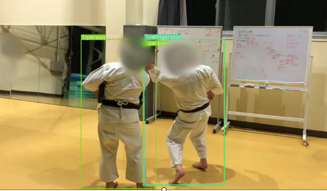
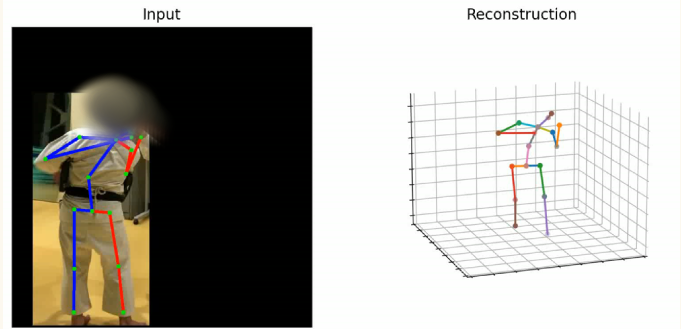

# Kosen2023-Multi2STE

このリポジトリは、高専時代の卒業研究の備忘録として作成されたものです。  
本研究では、単一人物向け3D動画姿勢推定モデルである StridedTransformer を、複数人が映る動画にも適用可能とするため、YOLOv7によるセグメンテーションを用いて人物ごとに切り分け、bottom-up的 に解決を試みました。

本研究の目的は、姿勢推定技術を武道（スポーツ）の修練に応用すること にあり、特に「型」をデータとして扱うための解析を行いました。  
当時指導いただいた教授及び、撮影・研究にご協力いただいた少林寺拳法部の先生方、仲間たちに深く感謝申し上げます。

> 使用していた動画像データは肖像権の都合により、非公開または一部削除されています。
<p align="center">
  <div style="display: inline-block; text-align: center; margin-right: 20px;">
    <br>
    <span><strong>人物検出 (Yolov7)</strong></span>
  </div>
  <div style="display: inline-block; text-align: center;">
    <br>
    <span><strong>姿勢推定 (Strided Transformer)</strong></span>
  </div>
</p>


##  プロジェクト構成

* **A\_yolov7/**: YOLOv7を用いた2D姿勢推定モデル
* **B\_StridedTransformer-Pose3D/**: Strided Transformerを用いた3D姿勢推定モデル
* **C\_plot3d\_with\_html/**: 3D姿勢データのHTML可視化ツール
* **D\_JSON/**: 姿勢データなどの数値群解析用
* **Makefile**: ビルドや実行の自動化スクリプト
* **environment.yaml**: Anaconda環境設定ファイル

##  環境構築

1. Anaconda環境の作成

   ```bash
   conda env create -f environment.yaml
   conda activate py38Multi2STE
   ```

2. 必要なモデルファイルの配置

   `B_StridedTransformer-Pose3D/demo/lib/checkpoint/` に下記ファイルを配置してください:

   * `pose_hrnet_w48_384x288.pth`
   * `yolov3.weights`

   ※ これらのファイルはGitHubのファイルサイズ制限 (100MB) を超えるため、リポジトリには含まれていません。

##  使用方法

1. 2D姿勢推定

   ```bash
   cd A_yolov7
   python detect.py --source path_to_video
   ```

2. 3D姿勢推定

   ```bash
   cd ../B_StridedTransformer-Pose3D
   python run.py --input path_to_2d_keypoints
   ```

3. 3D可視化

   ```bash
   cd ../C_plot3d_with_html
   python visualize.py --input path_to_3d_keypoints
   ```


